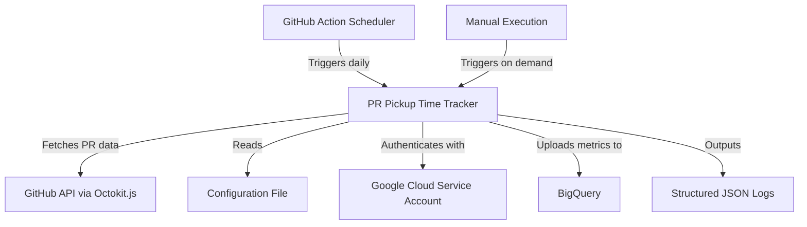
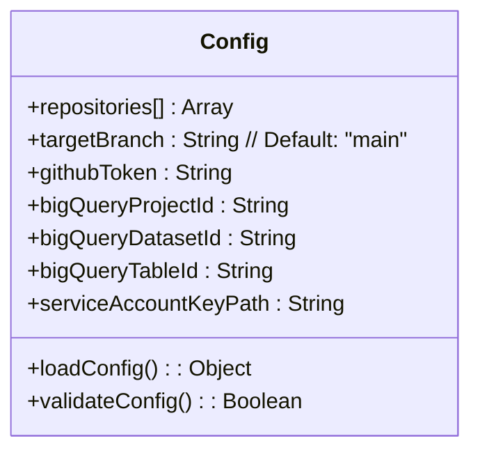
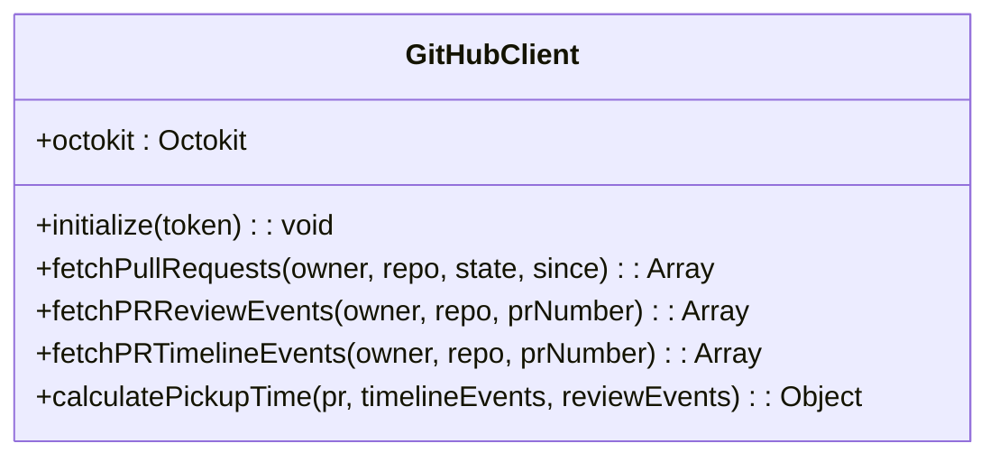
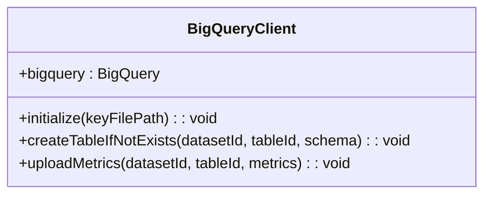
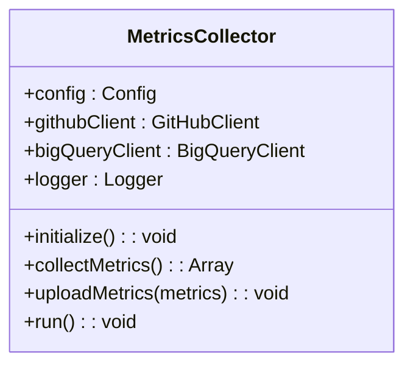
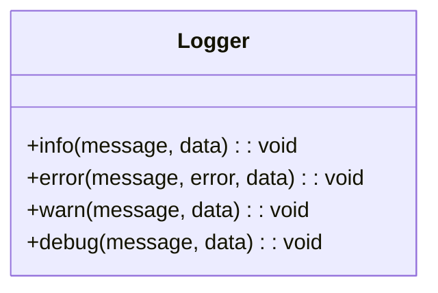

# Engineering Metrics Project Plan: PR Pickup Time Tracker

## Project Overview

**Objective**: Create a system to track the time between when a PR is marked as "Ready for Review" and when a reviewer starts looking at it (pickup time). The system will only track PRs that target the main branch.

**Definition of "Pickup Time"**:
- Start: Timestamp when a PR is marked as "Ready for Review"
- End: Timestamp of the first review submission (comment, approval, or changes requested)
- Pickup Time: The time difference between these two events

**Technology Stack**:
- Node.js with npm and ES modules
- Octokit.js for GitHub API interaction
- Google Cloud BigQuery for data storage
- GitHub Actions for scheduled execution

## System Architecture



## Component Breakdown

### 1. Configuration Module

This module will handle loading and validating configuration from files and environment variables.



Configuration will be loaded from:
- A `config.json` file for repository list and other settings
- Environment variables for sensitive information (can be overridden)
- GitHub Action inputs when running as an action

### 2. GitHub API Client

This module will handle all interactions with the GitHub API using Octokit.js.



The client will:
- Fetch PRs that have been updated within a configurable time window and target the main branch only
- Fetch timeline events to determine when a PR was marked as "Ready for Review"
- Fetch review events to determine when a reviewer first looked at the PR
- Calculate pickup time metrics

### 3. BigQuery Client

This module will handle authentication and data upload to BigQuery.



The BigQuery schema will include:
- `review_date`: Date when the reviewer started looking at the PR
- `pr_creator`: GitHub username of the PR creator
- `pr_url`: HTTP link to the PR
- `pickup_time_seconds`: Time in seconds from "Ready for Review" to first review
- `repository`: Repository name
- `pr_number`: PR number
- `target_branch`: Branch the PR is targeting (will always be "main")
- `ready_time`: Timestamp when PR was marked ready for review
- `first_review_time`: Timestamp of first review activity

### 4. Main Application

The main application will orchestrate the entire process.



### 5. Logger

A simple logging module that outputs structured JSON.



## Implementation Plan

### Phase 1: Project Setup and Configuration

1. Initialize Node.js project with npm
   - Create `package.json` with appropriate dependencies
   - Set up ES modules configuration
   - Configure testing framework (Jest)

2. Create configuration module
   - Implement config loading from file and environment
   - Add validation logic
   - Create sample configuration files

### Phase 2: GitHub API Integration

1. Implement GitHub client using Octokit.js
   - Set up authentication
   - Implement PR fetching logic
   - Implement timeline and review events fetching
   - Create pickup time calculation logic

2. Add unit tests for GitHub client
   - Mock API responses
   - Test pickup time calculation logic

### Phase 3: BigQuery Integration

1. Implement BigQuery client
   - Set up authentication with service account
   - Create table schema definition
   - Implement data upload functionality

2. Add unit tests for BigQuery client
   - Mock BigQuery responses
   - Test data transformation

### Phase 4: Main Application and Logging

1. Implement main application logic
   - Orchestrate the entire process
   - Handle error cases and retries
   - Implement logging with structured JSON output

2. Add integration tests
   - Test end-to-end flow with mocked external services

### Phase 5: GitHub Action Integration

1. Create GitHub Action definition
   - Define inputs and outputs
   - Set up workflow file
   - Configure scheduled execution

2. Add documentation
   - Create README with setup and usage instructions
   - Add examples for both standalone and GitHub Action usage

## File Structure

```
pickup-time/
├── .github/
│   └── workflows/
│       └── metrics-collector.yml
├── src/
│   ├── index.js              # Main entry point
│   ├── config.js             # Configuration module
│   ├── github-client.js      # GitHub API client
│   ├── bigquery-client.js    # BigQuery client
│   ├── metrics-collector.js  # Main application logic
│   └── logger.js             # Logging module
├── test/
│   ├── config.test.js
│   ├── github-client-general.test.js
│   ├── bigquery-client.test.js
│   └── metrics-collector.test.js
├── config.json               # Sample configuration
├── action.yml                # GitHub Action definition
├── package.json
├── package-lock.json
└── README.md
```

## GitHub Action Configuration

The GitHub Action will be configured to run daily and will accept the following inputs:

- `github-token`: GitHub token for API access
- `config-path`: Path to the configuration file
- `gcp-service-account-key`: Base64-encoded service account key JSON
- `bigquery-project`: Google Cloud project ID
- `bigquery-dataset`: BigQuery dataset ID
- `bigquery-table`: BigQuery table ID

Example workflow file:

```yaml
name: Collect PR Pickup Time Metrics

on:
  schedule:
    - cron: '0 0 * * *'  # Run daily at midnight
  workflow_dispatch:      # Allow manual triggering

jobs:
  collect-metrics:
    runs-on: ubuntu-latest
    steps:
      - uses: actions/checkout@v3
      
      - name: Set up Node.js
        uses: actions/setup-node@v3
        with:
          node-version: '18'
          
      - name: Install dependencies
        run: npm ci
        
      - name: Collect and upload metrics
        uses: ./
        with:
          github-token: ${{ secrets.GITHUB_TOKEN }}
          config-path: './config.json'
          gcp-service-account-key: ${{ secrets.GCP_SA_KEY }}
          bigquery-project: 'your-project-id'
          bigquery-dataset: 'github_metrics'
          bigquery-table: 'pr_first_review'
```

## Challenges and Considerations

1. **Rate Limiting**: GitHub API has rate limits. We'll implement a simple approach with basic retries when hitting rate limits. Since the tool runs on a daily schedule, we don't need complex rate limit handling strategies. If a run fails due to rate limits, it will automatically retry the next day.

2. **Historical Data**: Consider whether to collect historical data during the first run or only track new PRs going forward.

3. **Ready for Review Detection**: There are multiple ways a PR can be marked as ready for review (draft PR conversion, creation of a non-draft PR). The implementation needs to handle all cases.

4. **Reviewer Activity Detection**: We'll use the timestamp of the first review submission (comment, approval, or changes requested) to determine when a reviewer started looking at a PR. This approach provides a clear, unambiguous signal of reviewer engagement.

5. **Error Handling**: Implement robust error handling to ensure the process doesn't fail if one repository has issues.

6. **Data Privacy**: Ensure that sensitive data is not logged or stored inappropriately.

## Future Extensions

1. **Additional Metrics**: The architecture is designed to be extended with additional metrics beyond pickup time.

2. **Visualization**: Add a dashboard or visualization layer using Google Data Studio or similar tools.

3. **Notifications**: Add alerting for metrics that exceed certain thresholds.

4. **Multi-Organization Support**: Extend to support multiple GitHub organizations.
